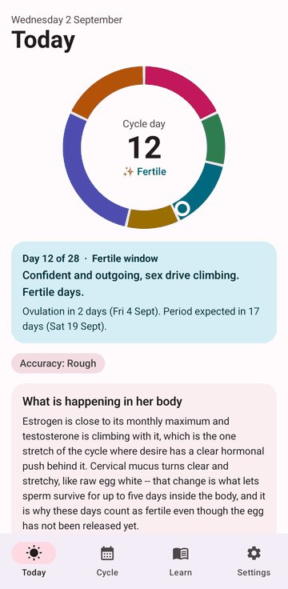
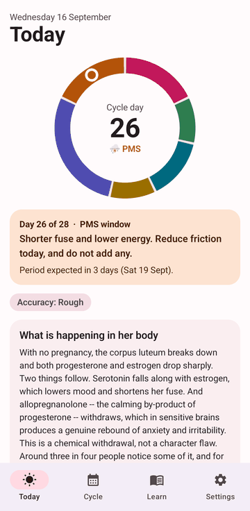
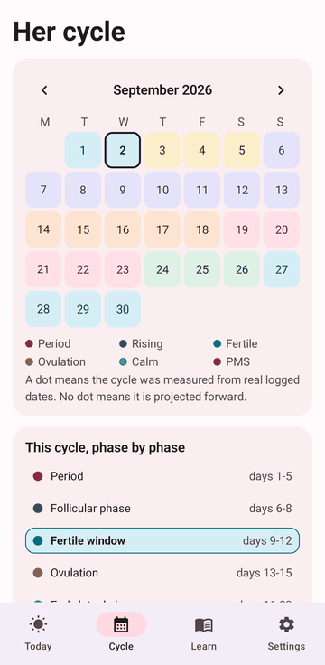
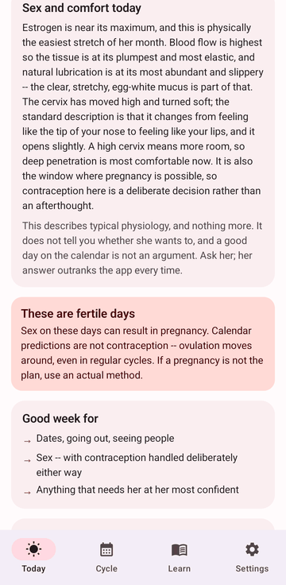
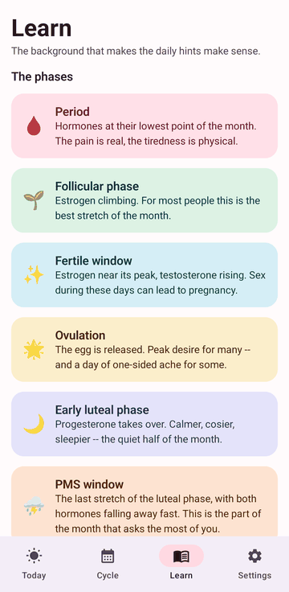
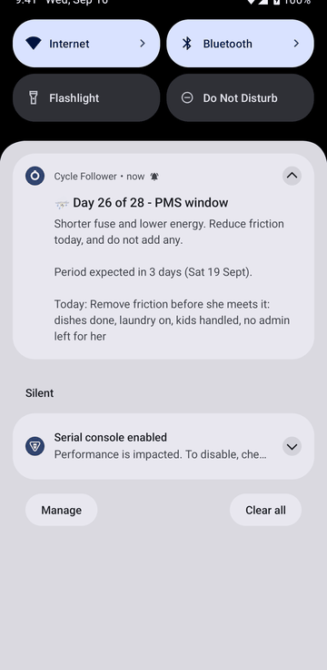
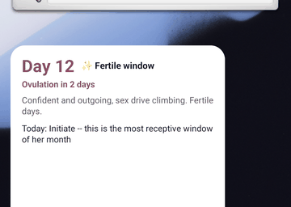

# Cycle Follower

**An Android app that answers the question most men never learn to answer: what is actually going
on with her this week, and what should I do differently because of it?**

Put in the date her last period started, answer a few questions about her, and the app tells you
where she is in her cycle, what her hormones are doing, what she is likely to be feeling — and,
the part that matters, what to do today and what to avoid.

It is written for the partner, not for the person having the cycle. Everything stays on the phone;
the app has no internet permission at all.

<p align="center">
  
  
  
</p>
<p align="center">
  
  
  
</p>
<p align="center">
  
</p>

---

## Get the app

**[Download the latest APK from the Releases page →](https://github.com/InfiniteLoopAI/cycle-follower/releases/latest)**

1. Open that page **on the phone** and tap the `.apk` file.
2. Android will ask whether to allow installs from your browser. Allow it, then tap **Install**.
3. Open Cycle Follower and answer the eight setup questions. Only one of them is required.

No Google Play, no account, no sign-in. Every build is signed with the same key, so a newer
version installs straight over an older one without uninstalling.

## Staying up to date

Android does not let a sideloaded app install updates silently — that needs device-owner or root
privileges, so any app claiming otherwise on a normal phone is either a system app or lying. What
you can have is **notified, then one tap**:

- **[Obtainium](https://github.com/ImranR98/Obtainium)** (recommended). An open-source app that
  watches GitHub Releases for any app you point it at. Add
  `https://github.com/InfiniteLoopAI/cycle-follower`, and it checks in the background, notifies you
  when a new build is out, downloads it, and hands it to Android's installer — you tap Install.
  Nothing changes in Cycle Follower, so it keeps its no-internet guarantee.
- **Watch → Custom → Releases** on this repo, if an email is enough.

An in-app update checker is deliberately *not* built in: it would require the `INTERNET`
permission, which is the one thing keeping this app provably unable to leak anything.

**Which build have you got?** Settings → About shows it, e.g. `Cycle Follower 1.0.0.12`. The
number after the version is the CI build, and it matches the release name on the Releases page.

---

## What it does

**Today** — one focal point. The cycle ring, one sentence on where she is, one quiet line of
timing, and two things worth doing, as plain text. The daily log is three buttons at the bottom.
Everything else — the science, sex and comfort, symptoms, energy levels, what the week is good for —
is one tap away rather than stacked on the screen you look at every morning.

**Plan** — the app knows her next four months, so use it. Best weeks for a trip, a visit or a hard
conversation; weeks to keep clear; and a date checker that answers "is the 26th a bad idea?" and
suggests a nearer date that isn't.

**Right now** — one button, only in the hard phases, for the moment it has actually gone wrong.
Dark and short: what is going on, three things to say, three not to, one thing to do. No scrolling.

**How was today?** — three taps. She never opens this app and logs nothing, so this is the only
measurement it gets. After a couple of cycles it stops using the textbook PMS window and starts
using hers, which is often a day or two out from the default.

**Cycle** — a colour-coded month calendar, the phase-by-phase breakdown of the current cycle, the
dates worth knowing (fertile window, ovulation, next period, when the PMS window opens), and an
honest read on how much to trust any of it.

**Learn** — eleven articles covering the cycle end to end: what each hormone actually does, how
ovulation and fertility really work, sex across the cycle, PMS versus PMDD, period pain and what
genuinely helps, how contraception changes everything, the mistakes men make, how to talk about it,
and when something is worth seeing a doctor about.

**Sex and comfort** — a per-phase read on what is physically going on: how much natural lubrication
there is, how plump and elastic the tissue is, and where the cervix is sitting and how soft it is.
It rises, softens and opens around ovulation, and sits low and firm during the period and the PMS
days — which maps directly onto the days that are physically easiest and the days most likely to be
uncomfortable. It says plainly that this is physiology and not permission.

**Daily notification** — one message each morning with the cycle day, a short read on her likely
mood, and one concrete thing to do about it.

**A day's notice** — an evening warning the night before a new phase starts, and only then. The
morning hint lands on the day it is already happening, which is too late to shop, cook or move a plan.

**App lock and backup** — optional unlock with whatever the phone already uses, a blanked
app-switcher thumbnail, and export/restore to a file you choose, with optional password encryption.
Everything the app knows otherwise lives in one place on one handset.

**Home screen widget** — cycle day, phase and the one-line mood read, without opening anything.

**Discreet mode** — strips the detail out of the notification and the widget so nothing personal
shows on a lock screen someone else might glance at.

---

## Why it asks for more than a date

A date alone gives a bad answer. These are the inputs that change the output, and why:

| Input | Why it matters |
|---|---|
| **Past period start dates** | With three or four logged, the app switches from your estimate to her real average cycle length and works out how much it varies month to month. The single biggest accuracy upgrade available. |
| **Cycle and period length** | Ovulation is found by counting back from the next period, so total length moves everything. Assuming 28 days when she runs 33 puts the fertile window out by most of a week. |
| **Contraception** | The big one. On the combined pill, implant or injection she does **not** ovulate — there is no fertile window, no estrogen peak, no progesterone rise, and the bleed on the pill is a withdrawal bleed rather than a real period. The app says something different instead of inventing a cycle that is not running. On a hormonal IUD or mini pill ovulation may or may not happen, and it says that too rather than guessing. |
| **PMS severity and PMDD** | Sets how many days ahead the premenstrual window opens — nothing at all, through to ten days — and how strongly the advice is worded. |
| **Her actual symptoms** | The app then mentions only the things she really gets, in the phase where they turn up, with what is behind each one and something concrete you can do — instead of describing an average woman. |

## How the predictions work

Day 1 is the first day of proper bleeding. Everything counts from there.

The stretch from ovulation to the next period is the stable part of the cycle — almost always 12 to
14 days whatever the total length — while the first half is what stretches and shrinks. So the app
finds ovulation by counting **14 days back from the next expected period**, not by assuming day 14.
On a 32-day cycle that is day 18; on a 25-day cycle it is day 11.

The fertile window is the five days before ovulation plus the day after, because sperm survive up
to five days in fertile cervical mucus while the egg lasts under a day.

Past cycles on the calendar are drawn using their real measured length, taken from the gap between
the two logged periods either side of them. Only future dates are projections, and they are marked
as such.

The app tells you how much to trust it — good, rough, or loose — based on how many cycles are
logged and how much they vary. When the period is late, or the last logged date has gone stale, it
says so instead of quietly returning a wrong phase.

---

## Privacy

There is **no `INTERNET` permission in the manifest**, so the app is technically incapable of
sending anything anywhere. No accounts, no analytics, no adverts, no cloud. Everything lives in one
file in the app's private storage, and uninstalling deletes it.

## The one rule

The app exists to change what *you* do. The moment it becomes a way to explain her feelings back to
her — *"is it your period?"* — it has made things worse than knowing nothing at all. It says this on
the first setup screen and again on the Today screen, deliberately.

It is also **not a medical device and not contraception**. It cannot diagnose anything, it cannot
tell you how she actually feels, and the day numbers must never be used to avoid or achieve a
pregnancy. For anything medical, a doctor. For how she feels, ask her.

---

## Building it yourself

Needs JDK 17 and the Android SDK (compileSdk 35).

```bash
./gradlew testDebugUnitTest    # 60 unit tests over the engine, planner, personalisation and backup format
./gradlew assembleRelease      # -> app/build/outputs/apk/release/app-release.apk
```

`.github/workflows/build-apk.yml` does the same on every push and publishes the APK to Releases.
`versionCode` comes from the CI run number, so every published build is a genuine update as far as
Android is concerned. A local build has `versionCode 1`, so installing one over a release build is
a downgrade and Android will refuse it — use `adb install -r -d`, or uninstall first.

### About the signing key — read this before you trust a build

`signing/cycle-follower.jks` is committed to this repository, and its password is in
`app/build.gradle.kts`. **This repository is public, so that key is public too.**

- **Why it exists.** CI would otherwise generate a fresh debug key on every run, changing the APK
  signature each build — and Android refuses to install an update signed with a different key. A
  fixed key is what makes "download the new APK and tap install" work.
- **What it does not do.** It is a self-signed key for sideloaded builds, not a Play Store upload
  key, and now that the repository is public it proves nothing whatsoever about who built an APK.
  Anyone can sign a package with it that your phone would accept as an update to this app. That is
  fine for building it yourself and installing it on your own phone. It is **not** a basis for
  trusting an APK handed to you from anywhere other than this repository's Releases page.
- **If you plan to share this app with other people**, replace it. Generate your own keystore, keep
  it off GitHub, and add four repository secrets — `KEYSTORE_BASE64` (the `.jks`, base64-encoded),
  `KEYSTORE_PASSWORD`, `KEY_ALIAS`, `KEY_PASSWORD`. The workflow picks them up automatically and
  ignores the committed one. Switching keys means uninstalling the app once before the next update
  will install.

---

## Licence

[MIT](LICENSE). Free to use, copy, modify and distribute, including commercially, provided the
copyright notice and licence text come along with it. No warranty of any kind — see the licence
text and the disclaimer above.

## Layout

```
app/src/main/java/com/infiniteloop/cyclefollower/
├── data/          profile, contraception model, symptom knowledge, storage
├── domain/        CycleEngine (the maths), PhaseGuides + Library (the knowledge base), Briefings
├── ui/            Compose screens: Today, Cycle, Learn, Settings, and the setup wizard
├── notify/        daily alarm, notification, reboot handling
└── widget/        home screen widget
```

The prediction engine is pure Kotlin with no Android dependencies, which is why ordinary unit tests
cover it — including one that checks every combination of cycle length, period length, PMS severity
and contraceptive method produces a phase timeline with no gaps, no overlaps and no missing days.
